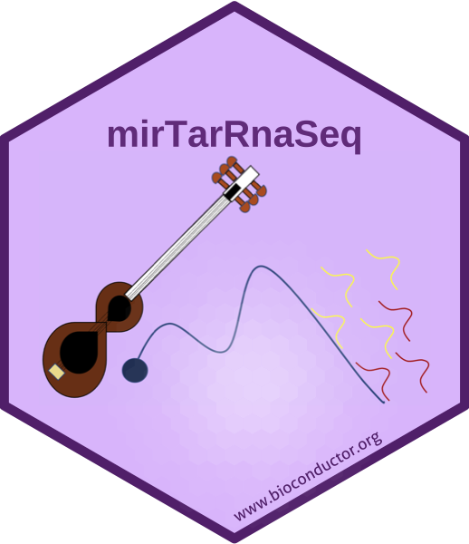

# mirTarRnaSeq

<!-- badges: start -->
[](https://github.com/Mercedeh66/mirTarRnaSeq/actions)
<!-- badges: end -->

## Installation
```
devtools::install_github('Mercedeh66/mirTarRnaSeq')
```
## Issues and bug reports
Please use https://github.com/Mercedeh66/mirTarRnaSeq/issues to submit issues, bug reports, and comments.
